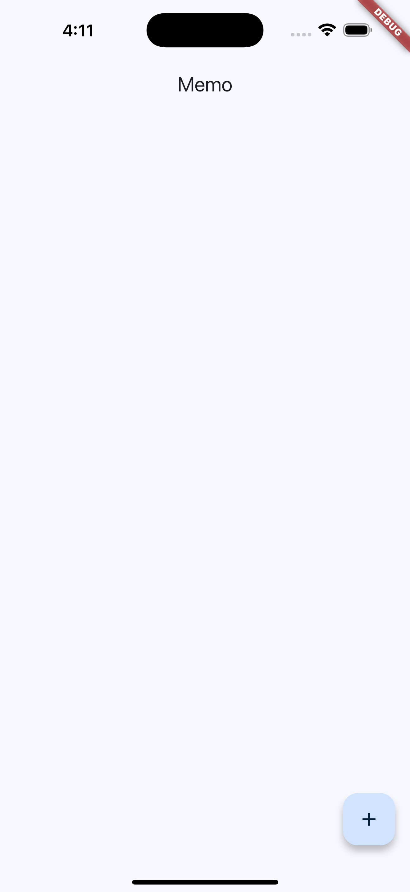
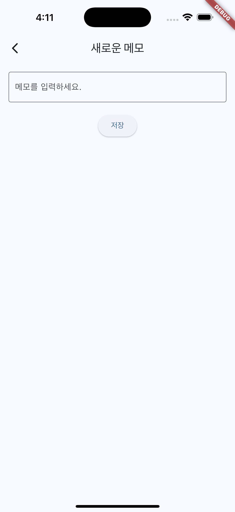
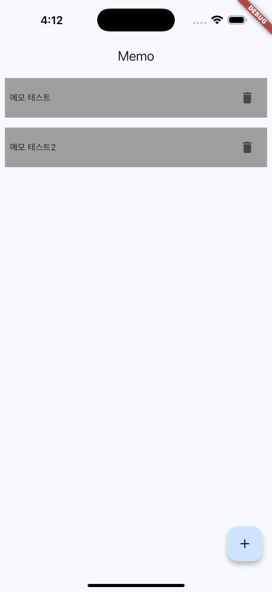
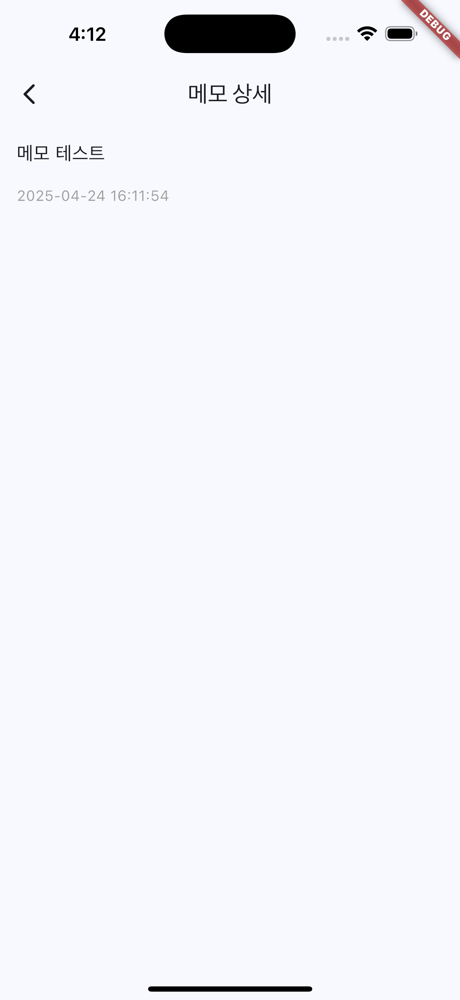
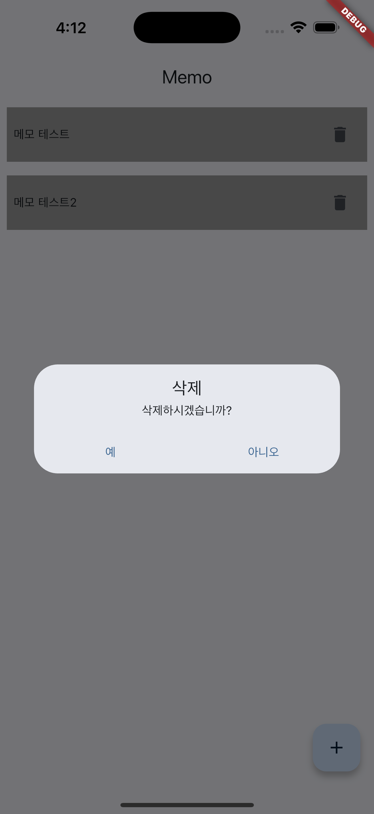

# 메모 앱

## 개요
메모 앱은 사용자가 메모를 생성, 삭제할 수 있는 간단한 Flutter 애플리케이션입니다. 상태 관리, 네비게이션, UI 디자인 등 기본적인 Flutter 개념을 보여줍니다.

## 기능
- 제목과 내용으로 새로운 메모를 추가할 수 있습니다.
- 저장된 모든 메모 목록을 볼 수 있습니다.
- 원하지 않는 메모를 삭제할 수 있습니다.
- 각 메모의 상세 정보를 확인할 수 있습니다.

## 스크린샷
앱의 주요 화면 스크린샷입니다:

| **홈(빈화면)** | **메모 추가** | **홈(리스트 추가)** | **메모 상세** | **삭제 팝업** |
|:-------:|:-------:|:-------:|:-------:|:-------:|
|  |  |  |  |  |